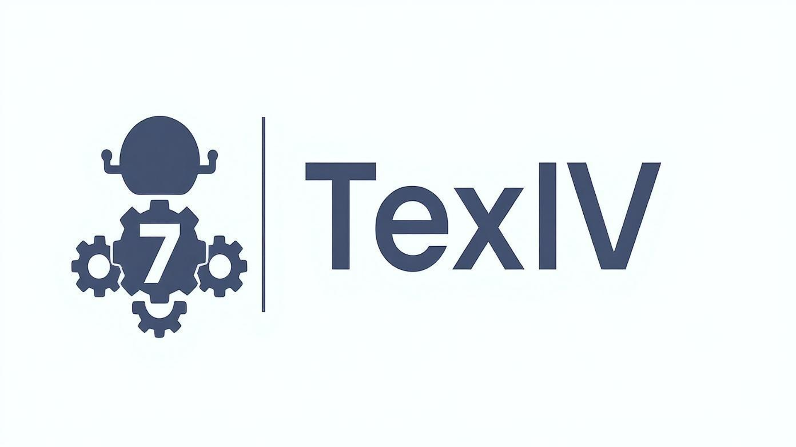

<p align="center">
  
</p>

---
A machine learning–based package for transforming text into instrumental variables (IV).

 
 
[](https://pypi.org/project/texiv/)
[](LICENSE)
[](https://github.com/sepinetam/texiv/issues/new)

[](https://github.com/sepinetam/texiv/wiki)
[](https://deepwiki.com/SepineTam/TexIV)

---

## 🌰 Example
Visit [Stata Example File](source/example/dofiles/main.do) and [Python Example File](source/example/pyscript/main.py).

There is a step-by-step example.

## ✨ Feature

- Support multiple Chinese word segmentation and embedding methods
- Customizable stopwords
- Support keyword relevance filtering and two-stage filtering
- Output includes frequency, total count, and ratio statistics

## 📦 Requirements

- Python 3.11+
- Recommended to use virtual environment (e.g., `venv` or `conda`)

## 🚀 Quickly Start

### Install
```bash
pip install texiv
```

### Usage
```python
from typing import List

from texiv import TexIV

texiv = TexIV()
content: str = "This is a test text..."
keywords: List[str] = ["keyword1", "keyword2", "keyword3"]
texiv.texiv_it(content, keywords)
```

Output example:

```
{'freq': 7, 'count': 34, 'rate': 0.20588235294117646}
```

## 🖥️ Command Line Tool

The project also provides a command-line interface that can be used directly after installation:

```bash
texiv --help
```

## 🛠️ Configuration

All models and parameters can be adjusted through configuration files in `～/.texiv/config.toml`.


## 📄 License
This project is licensed under the GNU Affero General Public License v3.0. See [LICENSE](LICENSE) for details.

**Note:** Commercial use requires compliance with AGPL-3.0 terms, including source code disclosure for network services.
